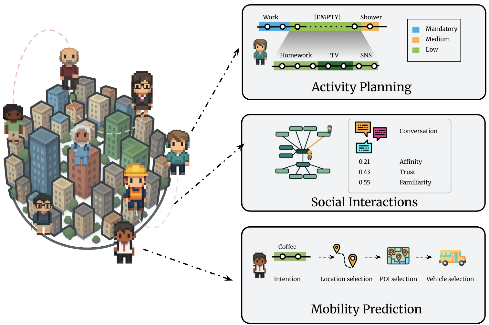

# CitySim: Modeling Urban Behaviors and City Dynamics with Large-Scale LLM-Driven Agent Simulation

## 📖 Description
Modeling human behavior in urban environments is fundamental for social science, behavioral studies, and urban planning. Prior work often rely on rigid, hand-crafted rules, limiting their ability to simulate nuanced intentions, plans, and adaptive behaviors. Addressing these challenges, we envision an urban simulator (CitySim), capitalizing on breakthroughs in human-level intelligence exhibited by large language models. In CitySim, agents generate realistic daily schedules using a recursive value-driven approach that balances mandatory activities, personal habits, and situational factors. To enable long-term, lifelike simulations, we endow agents with beliefs, long-term goals, and spatial memory for navigation. CitySim exhibits closer alignment with real humans than prior work, both at micro and macro levels. Additionally, we conduct insightful experiments by modeling tens of thousands of agents and evaluating their collective behaviors under various real-world scenarios, including estimating crowd density, predicting place popularity, and assessing well-being. Our results highlight CitySim as a scalable, flexible testbed for understanding and forecasting urban phenomena.

   
  <em>Figure 1: The CitySim Framework Architecture.</em>

## ⚙️ Usage
- 🆕 Prompts: All prompts used in CitySim can be found in the [`prompts`](./prompts) folder.  
- Code: Will be released soon!

